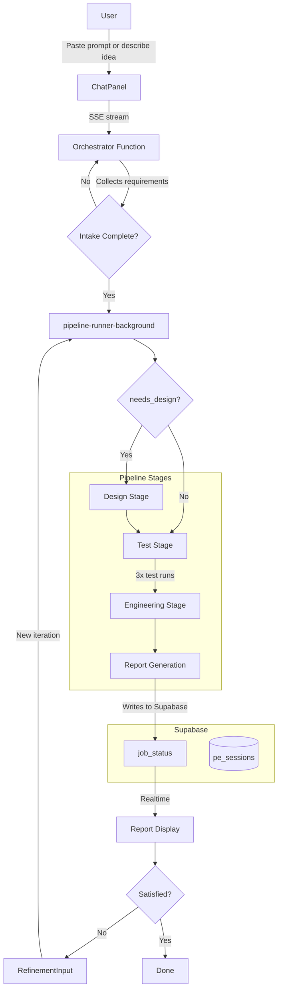

# Prompt Engineering Assistant

AI-powered prompt crafting, testing, and optimization tool with iterative refinement.


## Features

- Chat-based intake collects prompt text or idea description
- Multi-stage pipeline: design, 3x testing, engineering, reporting
- Optional prompt design from scratch (when user describes an idea instead of pasting a prompt)
- Iterative refinement — submit feedback to improve the engineered prompt
- Pipeline stage progress indicator
- Markdown report with engineered prompt, test results, and analysis
- PDF and Markdown download
- Session history with soft delete

## Tech Stack

| Layer | Technology |
|-------|-----------|
| Frontend | React 19, Vite, TypeScript |
| Auth | Clerk |
| Database | Supabase (PostgreSQL + Realtime) |
| AI | Google Gemini |
| Backend | Netlify Functions |
| Design System | @boriskulakhmetov-aidigital/design-system |

## Getting Started

```bash
git clone https://github.com/boriskulakhmetov-aidigital/AI-Labs-Prompt-Engineering-Assistant.git
cd AI-Labs-Prompt-Engineering-Assistant
npm install

# Create .env.local with Clerk, Supabase, and Gemini keys
npm run dev
```

## Architecture



## Folder Structure

```
src/
  main.tsx              ← Entry point, ClerkProvider, theme
  App.tsx               ← AppShell wrapper + domain logic
  components/
    SessionSidebar.tsx  ← Session list
    ProgressIndicator.tsx ← Pipeline stage progress
    RefinementInput.tsx ← Post-report refinement UI
  hooks/
    useOrchestrator.ts  ← SSE chat hook
  lib/
    types.ts            ← Domain types (PromptSubmission, PipelineStatus)
  pages/
    PublicReportPage.tsx
netlify/
  functions/
    _shared/            ← Auth, Supabase client
    orchestrator.mts
    pipeline-runner-background.mts
```

## Key Components

| Component | Purpose |
|-----------|---------|
| `AppShell` | Auth gate, layout, header (from design system) |
| `ChatPanel` | Chat UI (from design system) |
| `ProgressIndicator` | Pipeline stage indicator (revising, designing, testing, engineering) |
| `RefinementInput` | Post-report feedback input for iterative refinement |
| `SessionSidebar` | Session history list |

## Deployment

Auto-deploys on push to `main` via Netlify GitHub integration.
